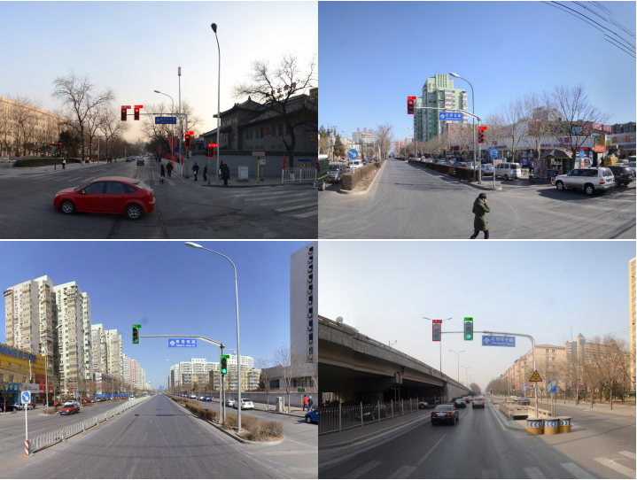

# Traffic-light-detection

### This is a test code of traffic lights detected under the Chinese street scene.

## Table of Contents

- [Background](#background)
- [Install](#install)
- [Usage](#usage)
- [Visualization](#visualization)

## Background

### Traffic light detection technology can help the driver detect the traffic light and identify its status, assist the driver to control the vehicle, and prevent illegal acts and safety accidents. Therefore, traffic light detection and recognition has practical significance for improving road traffic safety, and has broad development prospects in the field of automatic driving. This technology is based on yolo3 to detect and identify traffic lights, that is, the image is processed through yolo3 model to determine the location of traffic lights and classify them into six categories: Red, Green, Red left turn, Green forward, Red pedestrian and Other.

## Install

[Pytorch](https://pytorch.org/).

`pip install Cython`
`pip install numpy==1.17`
`pip install opencv-python`
`pip install matplotlib`
`pip install tensorboard`
`pip install scipy`
`pip install tqdm`
`pip install apex`
`pip install pandas`

## Usage

### Download the [weights](https://pan.baidu.com/s/1q42_TIgU4MtVJzDy4T586w?pwd=17nn) first, and paste them under the /weights folder.
### Downloda the [Chinese font](https://pan.baidu.com/s/121Oa_YPfrVmef2AJT36izQ?pwd=c8v5), and paste it under the Traffic-light-detection folder.

`python detect.py`

## Visualization

